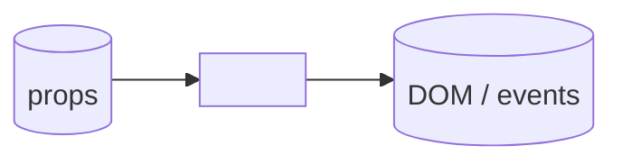
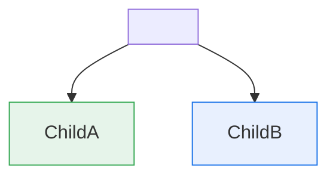

# Component page template

Copy this verbatim as the starting point for every
`spec/components/<Name>.md`. Delete or fill placeholders; do not
reorder sections.

```markdown
# <ComponentName>

**Classification:** Presenter | Container
**Purpose:** <One sentence. What does this render and why does it
exist as its own component?>

## Mock DOM

<!--
JSX-ish pseudo-markup. For containers, child components appear as
self-closing tags linking to their own page.
-->

```jsx
<ComponentName>
  <Header title={title} />
  <Body>
    {/* draw-inline region: describe it briefly */}
    <ChildComponent /> {/* link: ./ChildComponent.md */}
  </Body>
</ComponentName>
```

## Props

```ts
interface <ComponentName>Props {
  // Required first, optional after. One line of comment per prop
  // describing intent, not type — the type already says that.
  title: string;            // Page-level heading shown in the header
  items: ReadonlyArray<Item>; // Items to render; order is preserved
  onSelect?: (id: ItemId) => void; // Fires when the user picks an item
}
```

For containers, also document any IDs / queries the container resolves
internally:

```ts
// Internal: <ContainerName> resolves
//   getItems(userId) -> ReadonlyArray<Item>
//   via <hook or service>
```

## Contract diagram

See [`./<ComponentName>.mmd`](./<ComponentName>.mmd).



## Nesting

<!-- Only required for Containers. Delete this section for Presenters. -->



| Child            | Kind      | Page                                |
| ---------------- | --------- | ----------------------------------- |
| `<ChildA>`       | Presenter | [`./ChildA.md`](./ChildA.md)        |
| `<ChildB>`       | Container | [`./ChildB.md`](./ChildB.md)        |

## Variants / states

- **Default** — `[link to capture region]`
- **Empty** — `[link or "TBD: not in design"]`
- **Loading** — `[link or "TBD: not in design"]`
- **Error** — `[link or "TBD: not in design"]`

## Open questions

- <Anything the design didn't pin down: pluralization, overflow,
  truncation, focus order, etc.>
```
