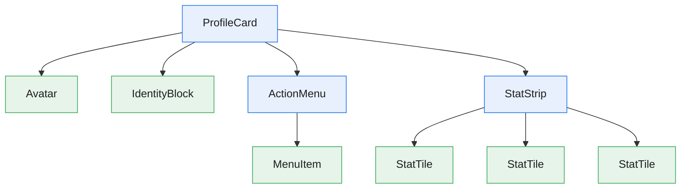
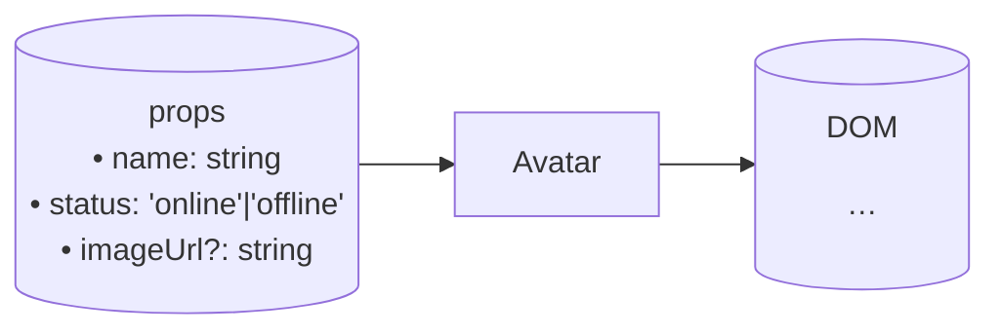

# Mermaid patterns

Two diagram kinds per composite component; one (contract) per
presenter. Use these templates verbatim and adapt names.

## 1. Nesting diagram (containers only)

File: `spec/nesting.mmd` (top-level) and the "Nesting" section of
each container's page.



Rules:

- Every leaf node carries the `presenter` class.
- Every internal node carries the `container` class.
- If a presenter appears more than once (e.g. `StatTile` in
  `StatStrip`), draw it once per occurrence so the tree is literal,
  not deduplicated.

## 2. Contract diagram (every component)

File: `spec/components/<Name>.mmd`.

### Presenter contract



### Container contract

```mermaid
flowchart LR
  Props[("props\n• userId: string")] --> C[ProfileCard]
  C -->|fetches| Svc[(getUser(userId))]
  Svc --> C
  C -->|name, status, imageUrl| A[Avatar]
  C -->|name, handle| I[IdentityBlock]
  C -->|onAction| Act[ActionMenu]
  C -->|stats| S[StatStrip]
  C --> Events[("events\n• onEdit(id)")]
```

Rules:

- Inputs (props, IDs) on the left as `[(…)]` cylinders.
- The component itself as a single rectangle.
- For containers, show external data sources as separate cylinders
  and label arrows with the data flowing.
- Show which props (or derived slices) go to which child, labeled on
  the arrow.
- Outputs (events, side effects) on the right as `[(…)]` cylinders.

## Why two diagrams

- **Nesting** answers "what does this contain?" — structural.
- **Contract** answers "what flows where?" — behavioral.

You need both. A nesting diagram without a contract diagram leaves the
implementer guessing at prop shapes; a contract diagram without a
nesting diagram makes it hard to see the tree.
